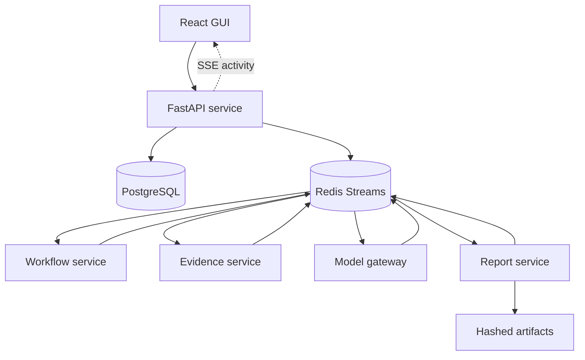

<div align="center">

# OmniTrade AI

### A Visual, Event-Driven Multi-Agent Financial Analysis Framework


OmniTrade AI collects several kinds of stock evidence, runs specialist agents in
parallel, challenges their views through a bounded debate, evaluates three risk
positions, and produces an explainable report with evidence lineage.

**Financial decision support only. The system never executes trades.**

</div>

---

## Contents

- [Why OmniTrade AI](#why-omnitrade-ai)
- [Main features](#main-features)
- [System workflow](#system-workflow)
- [Architecture](#architecture)
- [Technology](#technology)
- [Quick start](#quick-start)
- [Using the application](#using-the-application)
- [API](#api)
- [Testing and quality](#testing-and-quality)
- [Project structure](#project-structure)
- [Engineering documentation](#engineering-documentation)
- [Current limitations](#current-limitations)
- [Academic team](#academic-team)

## Why OmniTrade AI

The main software complexity is not a pretrained model or a financial formula.
It is the complete user-to-report workflow:

- Five evidence branches: market, fundamentals, news, macro, and sentiment.
- Typed ports and versioned workflow definitions.
- Parallel scheduling with deterministic joins.
- Required and optional branches with degraded results.
- Bounded bull-versus-bear research loops.
- Aggressive, balanced, and conservative risk reviews.
- Time, model-call, provider-call, token, and parallelism budgets.
- Validation, retries, fallback, cancellation, checkpoints, and safe resume.
- Full traceability from each report section to runtime events and evidence.

The project is implemented independently. Other trading-agent systems were used
only as study references; their workflow code was not copied or renamed.

## Main features

| Area | What the user can do |
|---|---|
| New Analysis | Select a stock, analysts, research depth, risk profile, models, data mode, report detail, language, currency, freshness, and budgets. |
| Agent Room | Follow real workflow events and read the output and impact of each agent. |
| Reports | Browse saved reports by calendar, compare agent views, inspect evidence, and export PDF or JSON. |
| Workflow Lab | Build, undo, validate, publish, and run typed workflow graphs with smart connection suggestions. |
| Profiles | Save default analysis settings for later runs. |
| Recovery | Cancel work or resume from checkpoints without repeating completed nodes. |

## System workflow

```mermaid
flowchart LR
    U["User configuration"] --> V["Validate run and workflow"]
    V --> P["Parallel evidence collection"]
    P --> Q["Normalize and check quality"]
    Q --> A["Four specialist analysts"]
    A --> D["Bounded bull and bear debate"]
    D --> T["Trading proposal"]
    T --> R["Three parallel risk views"]
    R --> M["Decision validation"]
    M --> O["Report, lineage, and export"]
```



Every node moves through explicit states such as `pending`, `ready`, `running`,
`succeeded`, `degraded`, `failed`, `skipped`, or `cancelled`. Each run keeps the
exact immutable workflow version that it executed.

## Architecture



One `docker-compose.yml` starts one application with eight containers:

1. React frontend
2. API service
3. Workflow service
4. Evidence service
5. Model gateway
6. Report service
7. PostgreSQL
8. Redis

The services are separated to make ownership, event flow, partial failure, and
recovery clear. They are still managed together with one Compose command.

## Technology

| Layer | Main tools |
|---|---|
| Frontend | React, TypeScript, Vite, Material UI, React Flow, TanStack Query |
| Backend | Python 3.12, FastAPI, Pydantic, SQLAlchemy, Alembic |
| Data | PostgreSQL and hashed filesystem artifacts |
| Events | Redis Streams and consumer groups |
| Reports | Structured JSON and ReportLab PDF |
| Testing | Pytest, Hypothesis, Vitest, Testing Library, Playwright |
| Quality | Ruff, mypy, TypeScript checks, GitHub Actions |
| Deployment | Docker Compose and Nginx |

## Quick start

### Requirements

- Docker Desktop with Docker Compose
- Git

### Run the full system

```bash
git clone <repository-url>
cd OmniTradeAI
cp .env.example .env
docker compose up --build -d
```

Open [http://localhost:5173](http://localhost:5173).

For the local demonstration profile, use:

```text
Username: demo
Password: demo
```

Stop the complete application with:

```bash
docker compose down
```

Use `docker compose down -v` only when you also want to remove local database
and Redis volumes.

### Configuration

Copy `.env.example` to `.env`. Never commit the real `.env` file.

| Variable | Purpose |
|---|---|
| `OMNITRADE_DATABASE_URL` | PostgreSQL connection string |
| `OMNITRADE_REDIS_URL` | Redis connection string |
| `OMNITRADE_JWT_SECRET` | Local authentication signing secret |
| `OMNITRADE_ARTIFACT_DIR` | Report and artifact location |
| `OMNITRADE_FIXTURE_MODE` | Uses deterministic recorded data when `true` |
| `OMNITRADE_OPENAI_BASE_URL` | Optional OpenAI-compatible gateway URL |
| `OMNITRADE_OPENAI_API_KEY` | Optional model gateway key |

Replace all example credentials and secrets before any shared deployment.

## Using the application

1. Open **New Analysis** and choose the stock and analysis policy.
2. Start the run and follow each node in **Agent Room**.
3. Open **Reports** to read every analyst, debate, risk, and manager view.
4. Use **Workflow Lab** for advanced graph editing.
5. Save the graph, validate it, and publish it before using the new version.

Workflow Lab uses the same typed-port rules as the backend validator. Selecting
a node shows its role and safe next-node suggestions. An invalid edge is blocked
before it enters the draft.

## API

The API is available at `http://localhost:8000`. Important routes include:

```text
POST   /api/v1/auth/login
GET    /api/v1/catalog
GET    /api/v1/analysis-options
GET    /api/v1/workflows
POST   /api/v1/workflows/{id}/validate
POST   /api/v1/workflows/{id}/publish
POST   /api/v1/runs
GET    /api/v1/runs/{id}
POST   /api/v1/runs/{id}/cancel
POST   /api/v1/runs/{id}/resume
GET    /api/v1/runs/{id}/events
GET    /api/v1/runs/{id}/lineage
GET    /api/v1/reports/{id}
GET    /api/v1/reports/{id}/export/{format}
```

Interactive OpenAPI documentation is available at
[http://localhost:8000/docs](http://localhost:8000/docs).

## Testing and quality

### Backend

```bash
python -m venv .venv
source .venv/bin/activate  # Windows: .venv\Scripts\activate
pip install -e ".[dev]"
pytest
ruff check omnitrade tests
mypy omnitrade
```

### Frontend

```bash
cd frontend
pnpm install --frozen-lockfile
pnpm test --run
pnpm build
pnpm exec playwright test
```

CI uses deterministic models and recorded evidence. Live provider tests must be
run separately. The workflow core has an 80% minimum coverage gate.

## Project structure

```text
OmniTradeAI/
├── omnitrade/              Python services and domain logic
│   ├── engine/             Catalog, validator, scheduler, and executors
│   └── infrastructure/     Redis event adapter
├── frontend/               React web application and browser tests
├── migrations/             Alembic database migrations
├── tests/                  Backend unit and integration tests
├── docs/                   Requirements, architecture, ADRs, and Agile evidence
├── artifacts/defense/      Reproducible defense-scenario evidence
├── scripts/                Verification and scenario scripts
├── docker-compose.yml      Complete local deployment
└── .github/workflows/      Continuous integration
```

## Engineering documentation

- [Product requirements](docs/requirements.md)
- [Architecture](docs/architecture.md)
- [Feature classification](docs/feature-categories.md)
- [Requirements traceability](docs/traceability.md)
- [Agile increments](docs/agile/increments.md)
- [Implementation evidence](docs/agile/implementation-evidence.md)
- [ADR 0001: Custom event engine](docs/adr/0001-custom-event-engine.md)
- [ADR 0002: Modular services](docs/adr/0002-modular-services.md)
- [Reuse register](docs/reuse-register.md)

## Current limitations

- The verified default mode uses deterministic recorded evidence.
- The current model selector exposes only the implemented deterministic fixture.
- Live providers and OpenAI-compatible models require configured adapters and keys.
- The system supports stocks only.
- It does not manage portfolios or connect to a broker.
- A recommendation is not a guarantee of correctness or future performance.

## Academic team

Developed for the Software Engineering course in the Bachelor Degree Course in
Data Analysis (L-31), University of Messina.

- Mohammadamin Jahanimajd — Matricola 557910
- Mehdi Talebikhatir — Matricola 558948

Course professor: Prof. Salvatore Distefano.

---

<div align="center">

**OmniTrade AI — transparent financial analysis through explicit software workflows**

</div>
