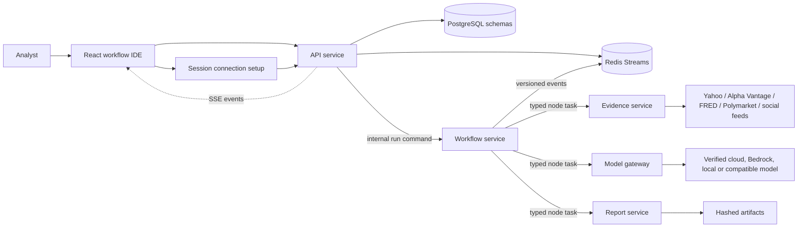
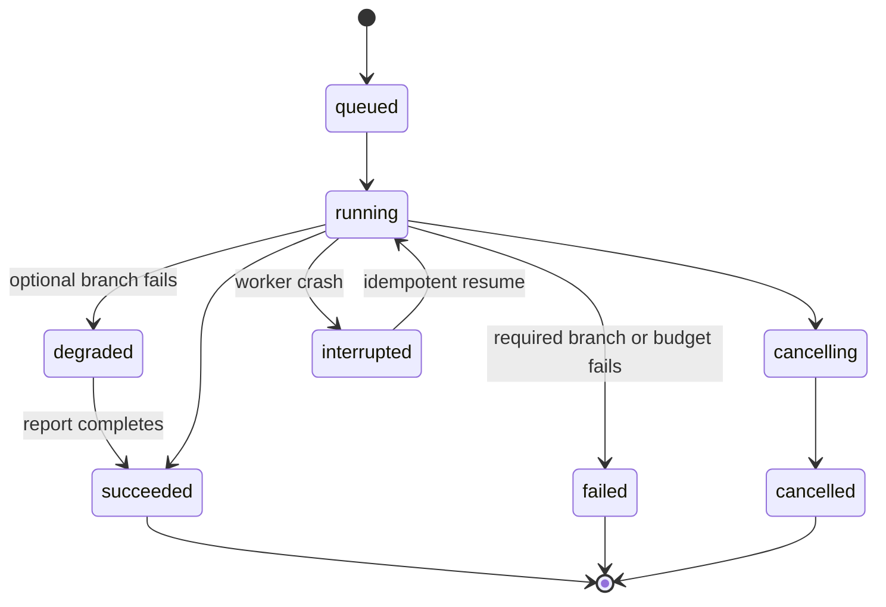

# Architecture

## Context and safety boundary

The browser sends commands to the API. The workflow service owns graph state and
scheduling. Evidence, model and report services execute typed tasks. PostgreSQL
stores durable state, Redis Streams transports versioned events, and an artifact
store keeps exports with hashes. There is no broker interface.

The API keeps verified credentials in process memory and sends only the needed
connection to each internal task. Credentials are not stored in PostgreSQL,
Redis events, reports or artifacts. Docker runs accept real providers only.
Recorded providers and deterministic models are isolated test seams used by CI.

## Main run state

## Event rules

Every event has `schema_version`, `event_id`, `event_type`, `run_id`, optional
`node_id`, `trace_id`, `occurred_at`, and a typed payload. Consumers store event
IDs before effects. Delivery is at least once; effects are idempotent. Consumer
groups isolate services. Failed events enter a dead-letter stream after bounded
retries.

## Data ownership

The API schema owns users and access data. Workflow owns workflow versions,
runs, node runs, checkpoints and events. Evidence owns normalized evidence and
provider call records. Model owns calls and budget usage. Report owns decisions,
claims, reports and artifact metadata. Cross-service access uses IDs and APIs,
not direct table coupling.
